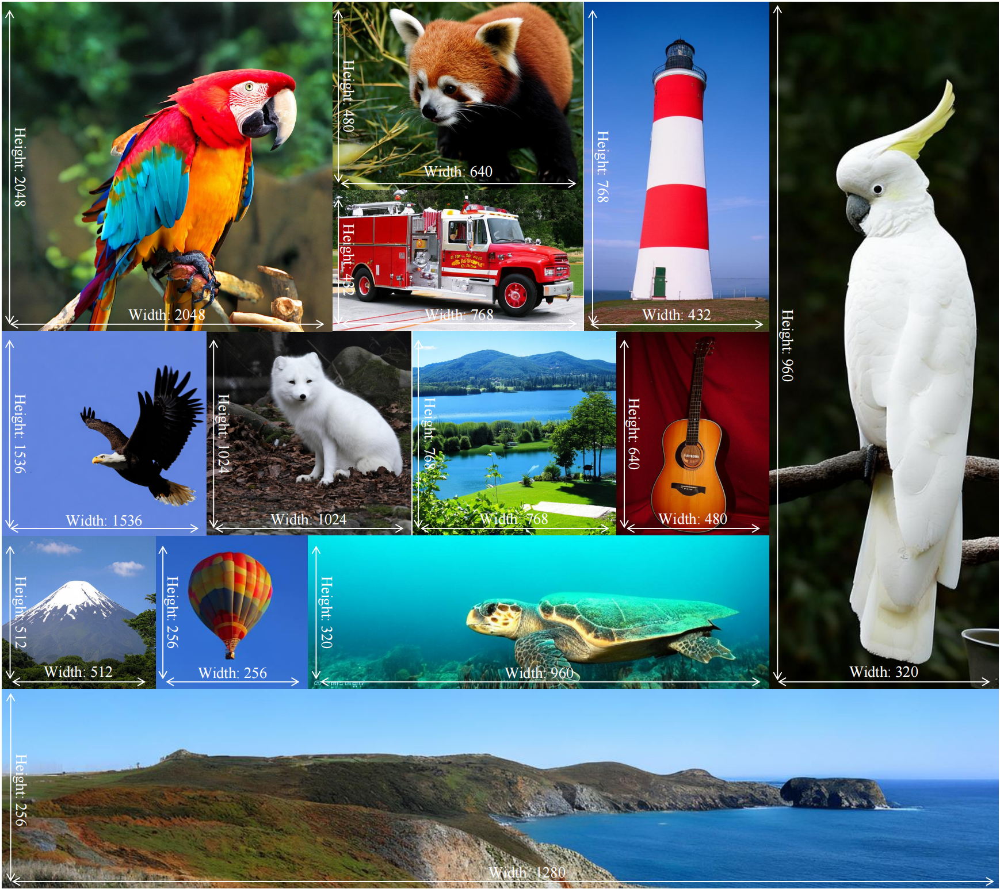

<h1 align="center"> Native-Resolution Image Synthesis</h1>


[](https://paperswithcode.com/sota/image-generation-on-imagenet-256x256?p=representation-alignment-for-generation)


<div align="center">
  <a href="https://github.com/WZDTHU" target="_blank">ZiDong&nbsp;Wang</a><sup>1,2</sup> 
  &ensp; <b>&middot;</b> &ensp;
  <a href="http://leibai.site" target="_blank">Lei&nbsp;Bai</a><sup>2,*</sup> 
  &ensp; <b>&middot;</b> &ensp;
  <a href="https://xyue.io" target="_blank">Xiangyu&nbsp;Yue</a><sup>1</sup> 
  &ensp; <b>&middot;</b> &ensp;
  <a href="https://wlouyang.github.io" target="_blank">Wanli&nbsp;Ouyang</a><sup>1,2</sup>
  &ensp; <b>&middot;</b> &ensp;
  <a href="https://invictus717.github.io" target="_blank">Yiyuan&nbsp;Zhang</a><sup>1,2,*</sup> </b>
  
  <sup>1</sup> MMLab CUHK &emsp; <sup>2</sup>Shanghai AI Lab <br>
  <sup>*</sup>Correspondance &emsp; <br>
</div>
<h3 align="center">
[<a href="https://sihyun.me/REPA">project page</a>]&emsp;
[<a href="http://arxiv.org/abs/2410.06940">arXiv</a>]&emsp;
[<a href="https://huggingface.co/datasets/GoodEnough/NiT-Preprocessed-ImageNet1K">Dataset</a>]&emsp;
[<a href="https://huggingface.co/GoodEnough/NiT-Models">Model</a>]&emsp;

</h3>
<br>


<b>Summary</b>: We propose Native-resolution diffusion Transformer (NiT), a model that explicitly learns varing resolutions and aspect ratios within its denoising process. This significantly improves training efficiency and generalization capability. To the best of our knowledge, <b>NiT firstly attains SOTA results on both $256\times256$ ($2.08$ FID) and $512\times512$ ($1.48$ FID) benchmarks</b> in class-guided ImageNet generation. NiT can also generalizes to arbitrary resolutions and aspect ratios, such as $4.52$ FID on $1024\times1024$ resolution, $4.11$ FID on $432\times768$ resolution.





# 1. Setup


First, clone the repo:
```bash
git clone https://github.com/WZDTHU/NiT.git
cd NiT
```

## 1.1 Environment Setup

```bash
conda create -n nit_env python=3.10
pip install torch==2.5.1 torchvision==0.20.1 --index-url https://download.pytorch.org/whl/cu118
pip install flash-attn
pip install -r requirements.txt
pip install -e .
```


## 1.2 Pretrained Model Setup

With a single model, NiT-XL can compete on multiple benchmarks and it achieves a dual SOTA on both ImageNet-$256\times256$ and $512\times512$ benchmarks.

| Model | Checkpoint | Model Size | FID-256x256 | FID-512x512 | FID-768x768 | FID-1024x1024 |
|---------------|------------|---------|------------|------------|------------|------------|
| NiT-XL-1000K | [🤗 HF](https://huggingface.co/GoodEnough/NiT-Models/resolve/main/model_1000K.safetensors) | 675M | 2.16 | 1.57 | 4.05 | 4.52 |


```bash
mkdir checkpoints
wget -c "https://huggingface.co/GoodEnough/NiT-Models/resolve/main/model_1000K.safetensors" -O checkpoints/model_1000K.safetensors
```


# 2 Sampling 

## 2.1 Sampling Hyper-parameters

The sampling hyper-parameters for NiT-XL-1000K are summarized as follows:
| Resolution | Solver | NFE | CFG - scale | CFG - interval | FID | sFID | IS | Prec. | Rec. |
| --- | --- | --- | --- | --- | --- | --- | --- | --- | --- |
| 256 × 256 | SDE | 250 | 2.25 | [0.0, 0.7] | 2.16 | 6.34 | 253.44 | 0.79 | 0.62 |
| 512 × 512 | SDE | 250 |  2.05 | [0.0, 0.7] | 1.57 | 4.13 | 260.69 | 0.81 | 0.63 |
| 768 × 768 | ODE | 50 | 3.0 | [0.0, 0.7] | 4.05 | 8.77 | 262.31 | 0.83 | 0.52 |
| 1024 × 1024 | ODE | 50 |  3.0 | [0.0, 0.8] | 4.52 | 7.99 | 286.87 | 0.82 | 0.50 |
| 1536 × 1536 | ODE | 50 |  3.5 | [0.0, 0.9] | 6.51 | 9.97 | 230.10 | 0.83 | 0.42 |
| 2048 × 2048 | ODE | 50 |  4.5 | [0.0, 0.9] | 24.76 | 18.02 | 131.36 | 0.67 | 0.46 |
| 320 × 960 | ODE | 50 |  4.0 | [0.0, 0.9] | 16.85 | 17.79 | 189.18 | 0.71 | 0.38 |
| 432 × 768 | ODE | 50 |  2.75 | [0.0, 0.7] | 4.11 | 10.30 | 254.71 | 0.83 | 0.55 |
| 480 × 640 | ODE | 50 |  2.75 | [0.0, 0.7] | 3.72 | 8.23 | 284.94 | 0.83 | 0.54 |
| 640 × 480 | ODE | 50 |  2.5 | [0.0, 0.7] | 3.41 | 8.07 | 259.06 | 0.83 | 0.56 |
| 768 × 432 | ODE | 50 |  2.85 | [0.0, 0.7] | 5.27 | 9.92 | 218.78 | 0.80 | 0.55 |
| 960 × 320 | ODE | 50 |  4.5 | [0.0, 0.9] | 9.90 | 25.78 | 255.95 | 0.74 | 0.40 |

## 2.2 Sampling Scripts

Sampling with NiT-XL-1000K model for $256\times256$-resolution images: 
```bash
torchrun \
  --nnodes 1 \
  --nproc_per_node 8 \
  projects/sample/sample_c2i_ddp.py \
  --config configs/c2i/nit_xl_pack_merge_radio_16384.yaml \
  --ckpt checkpoints/model_1000K.safetensors \
  --sample-dir ./samples \
  --height 256 \
  --width 256 \
  --per-proc-batch-size 32 \
  --mode sde \
  --num-steps 250 \
  --cfg-scale 2.25 \
  --guidance-low 0.0 \
  --guidance-high 0.7 \
  --slice_vae \
```


Sampling with NiT-XL-1000K model for $512\times512$-resolution images: 
```bash
torchrun \
  --nnodes 1 \
  --nproc_per_node 8 \
  projects/sample/sample_c2i_ddp.py \
  --config configs/c2i/nit_xl_pack_merge_radio_16384.yaml \
  --ckpt checkpoints/model_1000K.safetensors \
  --sample-dir ./samples \
  --height 512 \
  --width 512 \
  --per-proc-batch-size 32 \
  --mode sde \
  --num-steps 250 \
  --cfg-scale 2.05 \
  --guidance-low 0.0 \
  --guidance-high 0.7 \
  --slice_vae \
```


Sampling with NiT-XL-1000K model for $768\times768$-resolution images: 
```bash
torchrun \
  --nnodes 1 \
  --nproc_per_node 8 \
  projects/sample/sample_c2i_ddp.py \
  --config configs/c2i/nit_xl_pack_merge_radio_16384.yaml \
  --ckpt checkpoints/model_1000K.safetensors \
  --sample-dir ./samples \
  --height 768 \
  --width 768 \
  --per-proc-batch-size 32 \
  --mode ode \
  --num-steps 50 \
  --cfg-scale 3.0 \
  --guidance-low 0.0 \
  --guidance-high 0.7 \
  --slice_vae \
```

# 3 Evaluation

The sampling generates a folder of samples to compute FID, Inception Score and
other metrics. 
<b>Note that we do not pack the generate samples as a `.npz` file, this does not affect the calculation of FID and other metrics.</b>
Please follow the [ADM's TensorFlow
evaluation suite](https://github.com/openai/guided-diffusion/tree/main/evaluations)
to setup the conda-environment and download the reference batch. 
Given the directory of the reference batch `REFERENCE_DIR` and the directory of the generated images `SAMPLING_DIR`, run the following codes:
```bash
python projects/evaluate/adm_evaluator.py $REFERENCE_DIR $SAMPLING_DIR
```


# 4 Training

## 4.1 Dataset Setup

### 4.1.1 Preprocessed Dataset Download

Currently, we provide all the [preprocessed dataset](https://huggingface.co/datasets/GoodEnough/NiT-Preprocessed-ImageNet1K) for ImageNet1K. Please use the following commands to download the meta files and preprocessed latents.

```bash
mkdir datasets
mkdir datasets/imagenet1k

bash tools/download_dataset_256x256.sh
bash tools/download_dataset_512x512.sh
bash tools/download_dataset_native_resolution.sh
```

### 4.1.2 Preprocess ImageNet1K Locally

You can also preprocess the ImageNet1K dataset on your own. 
Take $256\times256$-image preprocess as example, you should first modify the `data_dir` as your local ImageNet1K directory in `configs/preprocess/imagenet1k_256x256.yaml`. 
Then run the preprocess script `scripts/preprocess/preorocess_in1k_256x256.sh`.
```bash
bash scripts/preprocess/preorocess_in1k_256x256.sh
```

The proprecessing procedure of $512\times512$-image and native-resolution image is similiar. 
Modify the corresponding config file and run the script.
```bash
bash scripts/preprocess/preorocess_in1k_512x512.sh
basb scripts/preprocess/preorocess_in1k_native_resolution.sh
```


## 4.2 Packing Setup

As we pack multiple image instances with distinct resolution into one sequence, we need to pre-set the image indices of each pack before the training process. 

### 4.2.1 Data-Meta Download
Down all the data-meta files firstly, which restore the height, width and other information of each image.
```bash
bash tools/download_dataset_data_meta.sh
```
The above command will download four the data-meta files on `datasets/imagenet1k/data_meta` directory:

- `dc-ae-f32c32-sana-1.1-diffusers_256x256_meta.jsonl`: data-meta file for $256\times256$-resolution image data.
- `dc-ae-f32c32-sana-1.1-diffusers_512x512_meta.jsonl`, data-meta file for $512\times512$-resolution image data.
- `dc-ae-f32c32-sana-1.1-diffusers_nr_meta.jsonl`, data-meta file for native-resolution image data.
- `dc-ae-f32c32-sana-1.1-diffusers_merge_meta.jsonl`, a merged file of the above three files.

The first two items of the native-resolution-image data-meta file (`dc-ae-f32c32-sana-1.1-diffusers_nr_meta.jsonl`) are as follows:
```json
{"image_file": "n01601694/n01601694_11629.JPEG", "latent_file": "n01601694/n01601694_11629.safetensors", "ori_w": 580, "ori_h": 403, "latent_h": 12, "latent_w": 18, "image_h": 384, "image_w": 576, "type": "native-resolution"}

{"image_file": "n01601694/n01601694_11799.JPEG", "latent_file": "n01601694/n01601694_11799.safetensors", "ori_w": 500, "ori_h": 350, "latent_h": 10, "latent_w": 15, "image_h": 320, "image_w": 480, "type": "native-resolution"}
```

### 4.2.2 Sampler-Meta Download

Given the maximum length $L$, we pre-set the image indices of each pack before training. 
Here we use the LPFHP (longest-pack-first histogram packing) algorithm to pack all the dataset.

You can download our preprocessed packed sampler-meta file using the following command.
```bash
bash tools/download_dataset_sampler_meta.sh
```
The above command will download three the data-meta files on `datasets/imagenet1k/sampler_meta` directory:
- `dc-ae-f32c32-sana-1.1-diffusers_merge_LPFHP_16384.json`: corresponds to $L=16384$. This is the setting in our experiments.
- `dc-ae-f32c32-sana-1.1-diffusers_merge_LPFHP_32768.json`, corresponds to $L=32768$.
- `dc-ae-f32c32-sana-1.1-diffusers_merge_LPFHP_65536.json`, corresponds to $L=65536$.


### 3.2.3 Prepare the Packing (Sampler-Meta) on Your Own

NiT supports training with images of arbitrary resolutions and aspect ratios, you can also prepare the packing (sampler-meta) according to your own demands.

```bash
# generate the default sampler-meta
python tools/pack_dataset.py
# generate the sampelr-meta for fixed 256x256-resolution experiment with the maximum sequence length of 16384
python tools/pack_dataset.py --data-meta datasets/imagenet1k/data_meta/dc-ae-f32c32-sana-1.1-diffusers_256x256_meta.jsonl --max-seq-len 16384
```


### 4.3 Image Encoder

We use RADIO-v2.5-H as our image encoder for REPA-loss.

```bash
wget -c "https://huggingface.co/nvidia/RADIO/resolve/main/radio_v2.5-h.pth.tar" -O checkpoints/radio_v2.5-h.pth.tar
```


## Training Scripts
The above steps setup the `packed_json`, `jsonl_dir`, and `latent_dirs` in `configs/c2i/nit_xl_pack_merge_radio_16384.yaml`. 
Before training, please specify the `image_dir` as the directory of ImageNet1K dataset in your own machine. 

Train XL-model: 
```bash
bash scripts/train_xl_model.sh
```
Train Base-model
```bash
bash scripts/train_b_model.sh
```


# BibTeX
```bibtex
```
